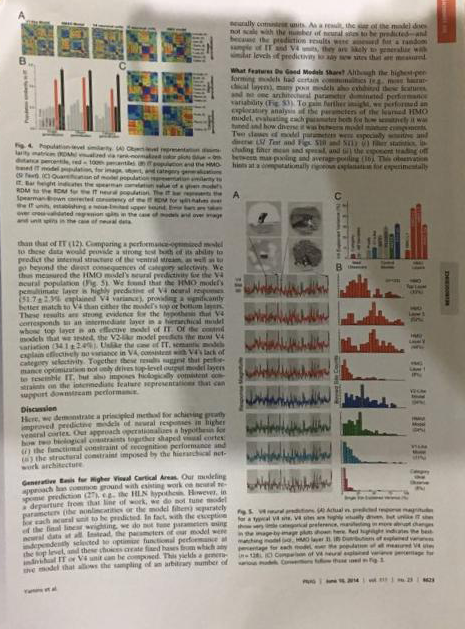
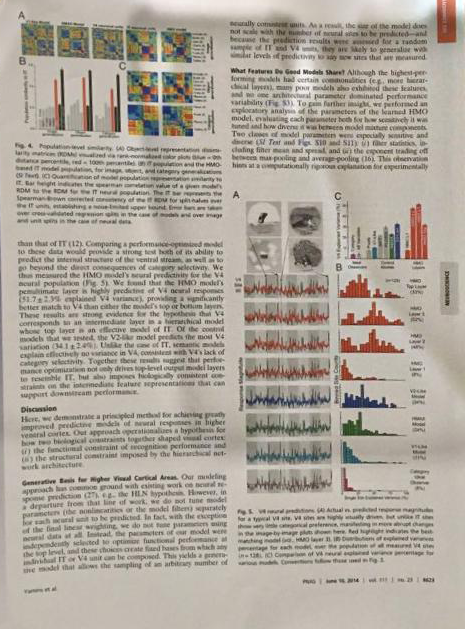
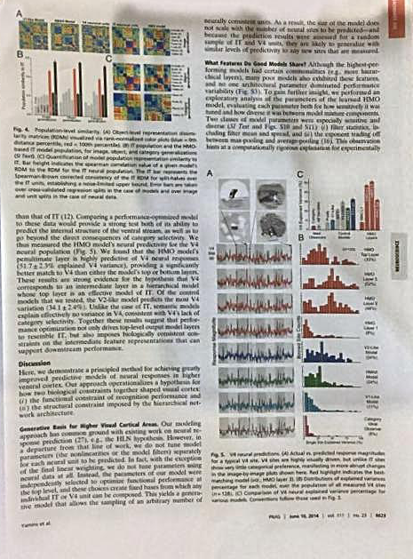
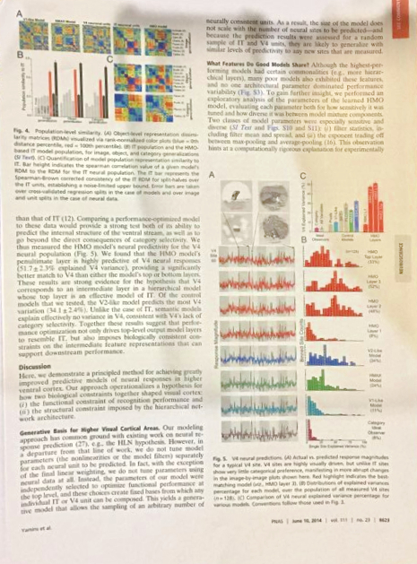
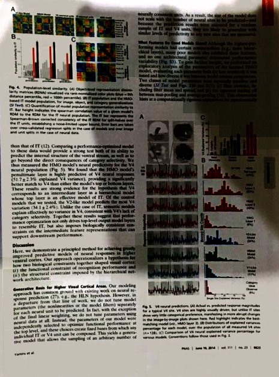
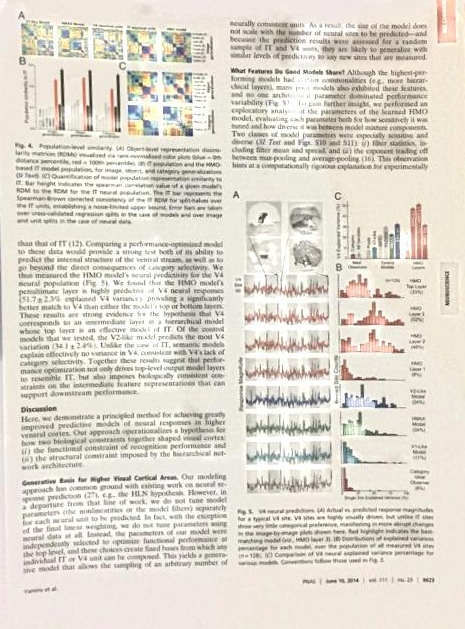
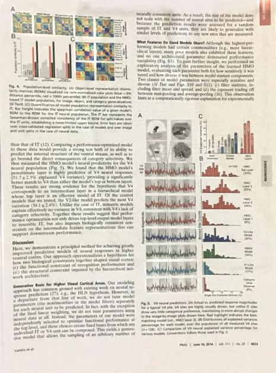
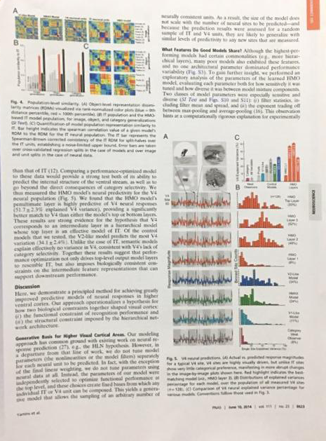

# Shading-Removal

  

    
    <figcaption>Original et al.</figcaption>
  

  

    
    <figcaption>Bako et al.</figcaption>
  

<figure>
  
  <figcaption>Kligler et al.</figcaption>
</figure>
<figure>
  
  <figcaption>Sternberg et al.</figcaption>
</figure>

<figure>
  
  <figcaption>Tableau et al.</figcaption>
</figure>

<figure>
  
  <figcaption>Zhang et al.</figcaption>
</figure>

<figure>
  
  <figcaption><b>Water-Filling.</b></figcaption>
</figure>

<figure>
  
  <figcaption>GroundTruth</figcaption>
</figure>

My second year project under advisor Prof. Changick Kim (2015.09~2016.03). The technique is for removing illumination distortions for camera captured document images. Project funded by Hancom company.

Related papers is under review:
Seungjun Jung, Muhammad Abul Hasan, and Changick Kim, "Water-Filling: An Efficient Algorithm for Digitized Document Shadow Removal," ACCV, December 2018.

Project Funded by Hancom Inc.

<h2> Requirements </h2>

opencv 3.0  
c++  

**********************Note***********************
Source Code Available, but do not use it without permission. (Patent Issue ... )  
Only Sample Results Available.
